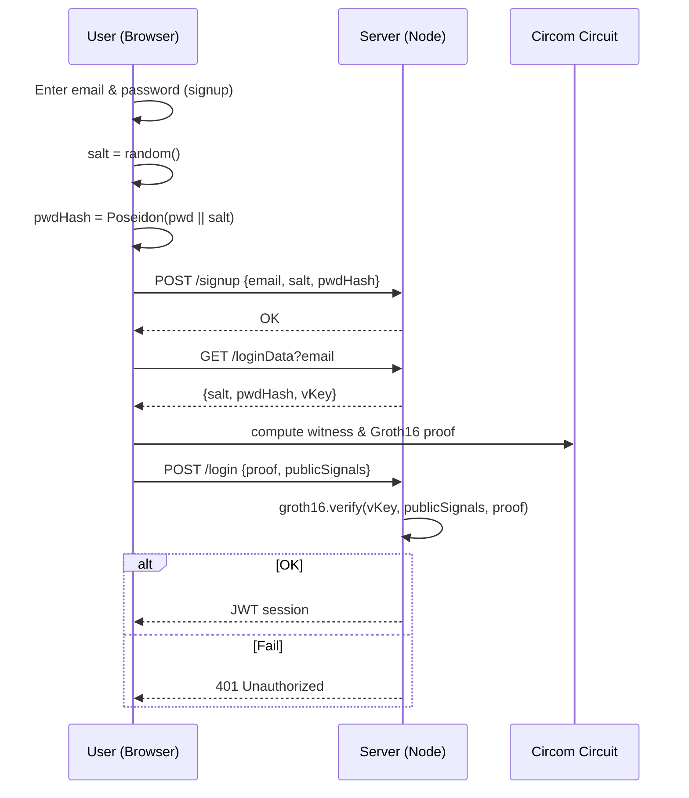

# Architecture & Technical Design



## Circuit Specification (`pwd_login.circom`)

| Signal              | Type          | Visibility | Notes                              |
| ------------------- | ------------- | ---------- | ---------------------------------- |
| `signal input pwd`  | Field element | Private    | Password mapped to a field element |
| `signal input salt` | Field element | Private    | 128-bit random salt                |
| `signal input C`    | Field element | Public     | Stored Poseidon commitment         |
| `signal output ok`  | Boolean       | Public     | Constraint forces `ok == 1`        |

Constraints:

```text
h <== Poseidon(pwd, salt);
ok <== (h === C);
```

Since equality yields a Boolean, we enforce `ok * (ok-1) == 0`.

Total gates: Poseidon (≈63 constraints) + 1 equality check + 1 Boolean constraint ≈ 70.

## Repository Layout

```
zk-login/
  circuits/
    pwd_login.circom
  keys/
    pwd_login.r1cs, pwd_login_js/, verifier_key.json, *.zkey
  server/
    index.ts            Express mock
    db.json             Fake user records
  ui/
    vite-react-app/
  docs/
    PRD.md
    Architecture.md
    Tasks.md
```

## APIs

- **POST /signup** – body `{ email, salt, commitment }`
- **GET /loginData?email** – returns `{ salt, commitment }` + cached verifierKey
- **POST /login** – body `{ proof, publicSignals }` → JWT

## Stretch: TOTP Extension

Add `signal input totp` (6-digit) and include `totp` in Poseidon pre-image; UI reads current TOTP from authenticator app.
